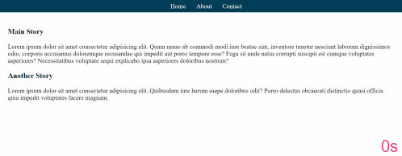

# animate-page-loading-tutorial

This page loading [tutorial](https://www.youtube.com/watch?v=nJ81DFmgHdU&list=PLZlA0Gpn_vH8mpXIUHjWoMAAgoCEinL0R&index=6&t=0s) is from [Web Dev Simplified](https://www.youtube.com/channel/UCFbNIlppjAuEX4znoulh0Cw). None of the code is mine, it is part of a series of tutorials that I am following to improve my knowledge of CSS. Here is a gif of the page loading:

My rendering of this tutorial is [published on Git Hub](https://martucazpo.github.io/animate-page-loading-tutorial/).